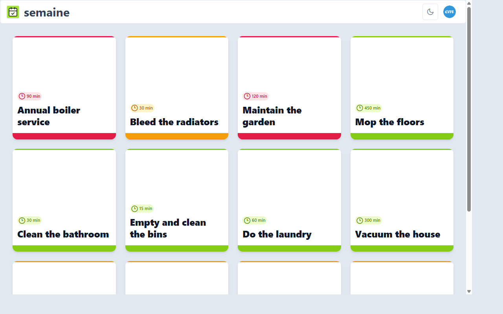

# Semaine

A household chore management app built with Angular 21 and Supabase. Tasks define recurring schedules (daily, weekly, monthly, yearly, or one-off); chores are generated automatically and displayed as cards ready to be completed.



### Features

- **Chores dashboard** — view and close upcoming chores
- **Task management** _(admin)_ — create and schedule recurring tasks with difficulty, duration, and tags
- **User management** _(admin)_ — invite users via email, manage roles
- **OAuth login** — sign in with Google or GitHub
- **Dark mode** — user-level preference

**Stack:** Angular 21 · Supabase (auth + database + edge functions) · Azure Static Web Apps · Terraform

## Development

### Prerequisites

- [pnpm](https://pnpm.io/) package manager
- [Supabase CLI](https://supabase.com/docs/guides/cli)

### Commands

```bash
pnpm start        # Dev server on localhost:4200
pnpm build        # Production build
pnpm test         # Run Vitest tests
pnpm lint         # ESLint check
pnpm lint:fix     # Auto-fix ESLint issues
pnpm format       # Format with Prettier
```

### Supabase Local Configuration

**1. Create your local environment file:**

```bash
cp src/env/environment.ts src/env/environment.local.ts
```

**2. Edit `src/env/environment.local.ts` with your credentials:**

```typescript
export const environment = {
  production: false,
  supabase: {
    url: "https://your-project.supabase.co",
    key: "your-anon-key",
  },
};
```

**3. Start the dev server with local configuration:**

```bash
pnpm start --configuration=local
```

> `environment.local.ts` is ignored by Git and will never be committed.

**Supabase Dashboard — Authentication → URL Configuration:**

- **Site URL**: your production URL
- **Redirect URLs**: `http://localhost:4200`, `https://*.westeurope.6.azurestaticapps.net` (PR preview environments)

### Database Migrations

#### Creating and Testing Migrations Locally

```bash
supabase migration new <migration_name>   # Create a new migration
supabase db push                          # Apply migrations to local database
```

#### Pushing Migrations to Remote Database

To apply your local migrations to the remote Supabase database:

**1. Get your database password:**

- Go to [Supabase Dashboard](https://app.supabase.com) → Your Project → **Database** → **Connection Info**
- Click "Afficher le mot de passe" (Show Password) to reveal it

**2. Link your project (first time only):**

```bash
supabase link --project-ref xzohmittisigvgxjwczw
```

**3. Push migrations to remote:**

```bash
export SUPABASE_DB_PASSWORD=your_db_password
supabase db push
```

### Edge Functions

| Function      | Description                              | Auth               |
| ------------- | ---------------------------------------- | ------------------ |
| `invite-user` | Sends an invitation email to a new user. | Admin JWT required |

The `invite-user` function requires the service role key:

```bash
supabase secrets set SUPABASE_SERVICE_ROLE_KEY=<your-service-role-key>
supabase functions deploy
```

## Infrastructure (Terraform)

Azure infrastructure is managed with Terraform in the `infra/` directory.

```bash
cd infra
terraform init
terraform plan
terraform apply
```

> Set your `subscription_id` in `infra/terraform.tfvars` (not committed to Git).

## CI/CD

All deployments are automated via GitHub Actions on push/merge to `main`.

### Required GitHub Variables (`Settings > Variables > Actions`)

- `AZURE_CLIENT_ID`
- `AZURE_TENANT_ID`
- `AZURE_SUBSCRIPTION_ID`
- `SUPABASE_URL`

### Required GitHub Secrets (`Settings > Secrets > Actions`)

- `AZURE_STATIC_WEB_APPS_API_TOKEN`
- `SUPABASE_KEY`

### Workflows

| Workflow                    | Trigger         | Actions                                   |
| --------------------------- | --------------- | ----------------------------------------- |
| `azure-static-web-apps.yml` | Push/PR to main | Build and deploy to Azure Static Web Apps |
| `terraform-validate.yml`    | Push            | Format, validate, tfsec security scan     |
| `terraform-plan.yml`        | PR to main      | Generate plan and comment on PR           |
| `terraform-apply.yml`       | Merge to main   | Apply infrastructure changes              |

### Azure OIDC Setup

GitHub Actions authenticate to Azure via **OIDC** (no secrets stored):

1. Create an **App Registration** in Azure AD
2. Add two **Federated Credentials** (_certificates & secrets_) for the GitHub repository, one for main branch and second one for PR
3. Grant **Contributor** role on the tfstate resource group
4. Grant **Contributor** role on the web app resource group
